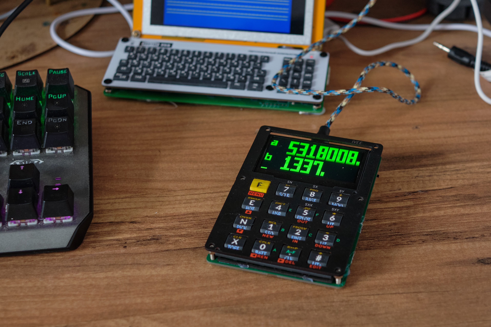

# Design files for IVEE Forth-based calculator

The original is here: https://github.com/zooxo/iv ( [Youtube demo](https://www.youtube.com/watch?v=m1aFRhqvuLM) )

Expectation:

Reality:

[Youtube video of IVEE](https://www.youtube.com/watch?v=LmGt2pndoQI)

### KiCad project

[Open in kicanvas.org](https://kicanvas.org/?github=https%3A%2F%2Fgithub.com%2Fsvofski%2Fcalculator-ivee%2Ftree%2Fmaster%2Fhardware%2Fcalc)

### Parts reference:

OLED 2.42 inch https://aliexpress.com/item/32950307344.html

switches SKRRAAE010 https://aliexpress.com/item/1005004917288663.html

on/off switch MSK-12C02 https://aliexpress.com/item/4000685483225.html

### Other

Battery shared load circuits:

 * https://forum.arduino.cc/t/proper-usage-of-lithium-charger-based-on-tp4056/477206/2
 * https://forum.arduino.cc/t/powering-a-pro-micro-board-with-li-ion-battery-and-usb-connector/572981/3
